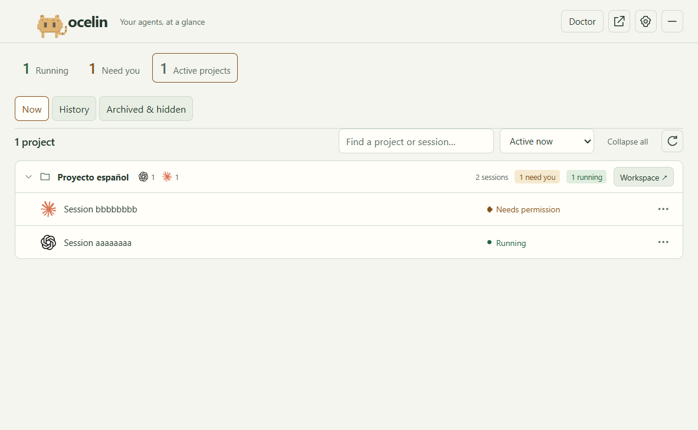
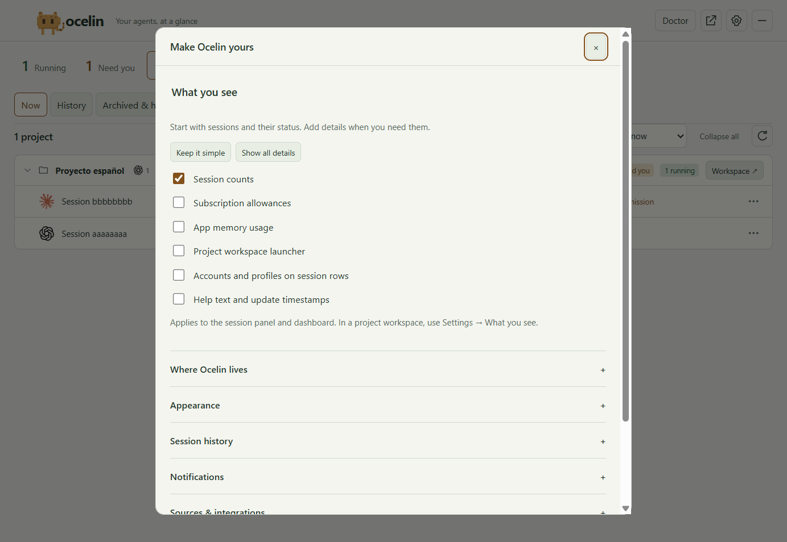
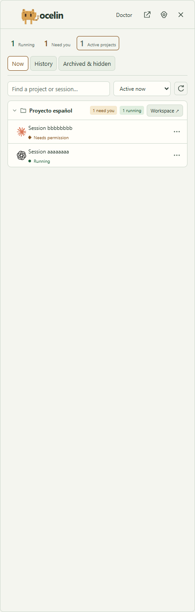
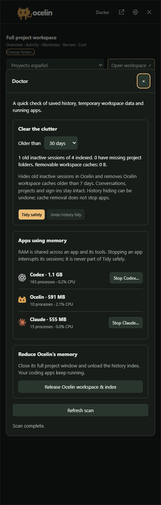
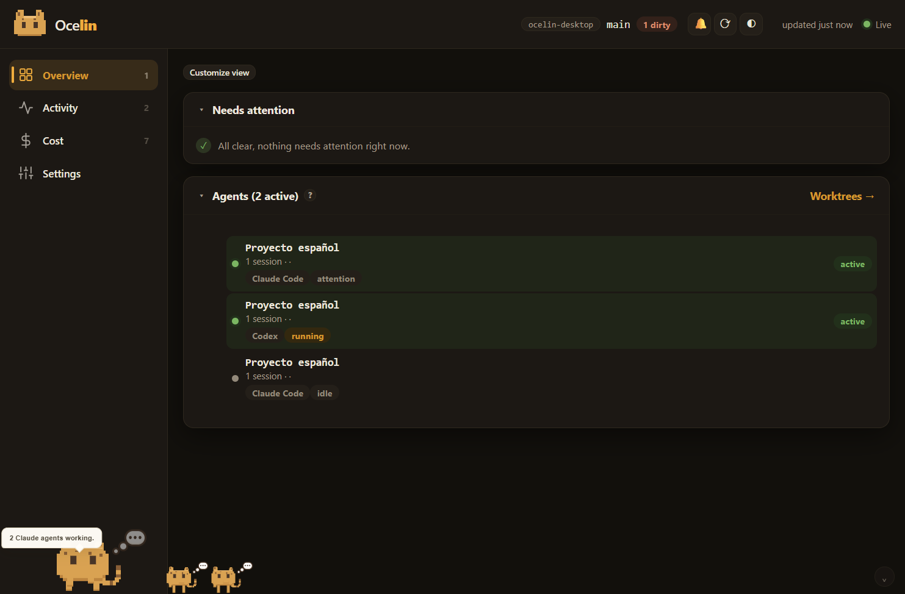
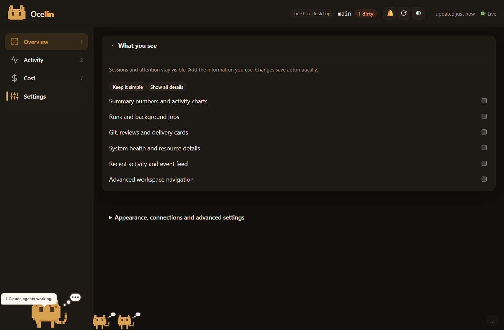
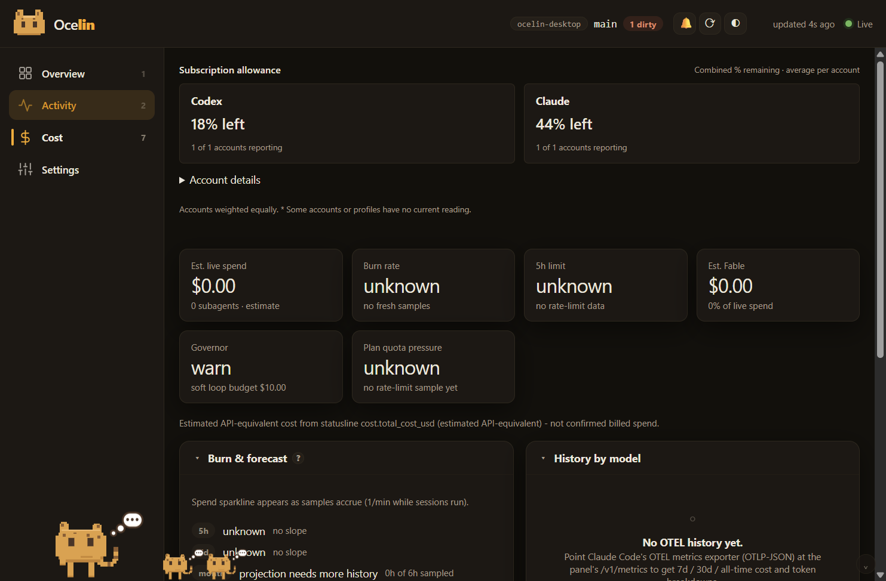

<p align="center"></p>

# Ocelin

Ocelin, formerly Clawdeck, brings **Codex and Claude Code sessions into one local view**. Find active work, inspect recent messages, search saved conversations and reopen the relevant task. Use the browser dashboard for a project, or the optional Windows companion for desktop status.

[Try the 0.6.8 Windows preview](https://github.com/m-sanchez/ocelin/releases/tag/v0.6.8) · [Browser quickstart](#quickstart) · [Website](https://miguelsanchez.co.uk/ocelin/) · [Desktop compatibility](docs/WINDOWS-DESKTOP.md)

The Windows installers are unsigned previews with manual updates. Native shell features have additional Windows requirements. Local monitoring reads provider history on this computer; optional **Ask Ocelin** sends your question and a compact, secret-scanned state snapshot through Claude Code to its configured model service.

## Release choices

| Release | Use |
| --- | --- |
| [0.6.8](https://github.com/m-sanchez/ocelin/releases/tag/v0.6.8) | The existing preview used by the quickstart below, with Windows installer and browser package. |
| [0.7.0-preview.2](https://github.com/m-sanchez/ocelin/releases/tag/v0.7.0-preview.2) | Experimental preview with simpler default views, display controls, diagnostics and transcript search. See the release notes and [preview limits](docs/WINDOWS-DESKTOP.md#validation-and-preview-limits). |
| [`clawdeck-panel` on npm](https://www.npmjs.com/package/clawdeck-panel) | Earlier 0.3.0 Clawdeck browser package. It is separate from the GitHub preview downloads. |

The browser core has zero runtime dependencies. The optional Windows app includes its runtime. GitHub preview packages provide both `ocelin` and `clawdeck` commands; the existing npm package keeps its `clawdeck` command. Old repository links redirect to `m-sanchez/ocelin`.

## Windows companion

Choose an x64 installer from the release table above. Sign-in startup and lifecycle hooks are optional. The following tour covers features across the previews; the linked release notes identify changes in each version.

**Now** groups active sessions by project. In 0.7.0-preview.2, **Settings > What you see** lets you enable allowances, measured app RAM, account details and hints individually. Hover a conversation to read its latest request and response; click to continue in the exact Codex or Claude task. **History** searches saved conversations, including those with missing project folders. Select old sessions to hide them in Ocelin, or archive/restore Codex sessions through its native API.

**Subscription allowance** shows the percentage left for each reported Codex and Claude session, weekly and model-specific limit, with reset countdowns. The desktop refreshes signed-in provider readings every two minutes; the project Cost page uses the same local snapshot. Missing or expired readings stay unavailable. [Usage sources and account scope](docs/WINDOWS-DESKTOP.md#subscription-allowance).

Connect additional signed-in local profiles in **Settings > Account profiles** for separate allowance cards and source labels on sessions. Use **Open workspace** at the top of the panel to return to the original project tools, or **Choose folder…** to open another project.

The taskbar puts **running sessions and subscription % left** first. Settings can switch its second line to per-app running counts or RAM, and choose weekly, five-hour or the lowest remaining limit. Percentages stay separate for Codex and Claude. **Doctor** in the panel tidies old inactive history with Undo, removes old Ocelin workspace caches, and offers explicit controls to stop a selected app and its tools or release Ocelin's workspace and history index.

Windows options include the tray, Ctrl Alt O quick panel, floating bar, dashboard, a [native App Tasks development bridge](desktop/native/README.md), and the [optional Taskbar Widgets strip](desktop/integrations/taskbar-widgets/README.md). Native shell features have additional OS/package requirements. [What 0.6 implements and how it was validated](docs/OCELIN-0.6-VALIDATION.md).

Screenshots from **Ocelin 0.7.0-preview.2**, captured on **4 October 2026**, using sample conversations, accounts and allowance readings. Memory figures come from the capture machine. The dashboard and session panel show the simpler default view.



Choose how much information appears in the dashboard and session panel:



| Sliding session panel | Doctor: cleanup and memory |
| --- | --- |
|  |  |

The movable floating tile can show the same running counts and allowance percentages as the optional taskbar strip:


From source (Node 22.12 or newer):

```powershell
cd desktop
npm ci
npm start
```

## Browser dashboard

[](https://github.com/m-sanchez/ocelin/actions/workflows/ci.yml)
[](LICENSE)
[](https://www.npmjs.com/package/clawdeck-panel)
[](package.json)
[](package.json)
[](https://github.com/m-sanchez/ocelin/stargazers)

An **unofficial local dashboard for Claude Code and Codex**. Point it at any project you
work on with either assistant and it shows what is actually happening: live
sessions, an event timeline, cost and context telemetry, git worktrees,
reviews, and delivery state - in one local web UI.

Choose a project's **Workspace** button in the companion to reach the project dashboard. It starts with sessions and attention; use **Customize view** to enable more information.





## Feature tour

**Git + Claude Workbench** (Delivery hub) - what stands between this branch
and a shipped change, connected to the code and to Claude.

- **Readiness** answers two questions separately, because they are different
  questions: can the REMOTE change merge, and has all the LOCAL work reached
  it. A dirty worktree blocks the second and not the first. Each axis is
  `READY | BLOCKED | UNKNOWN`, and UNKNOWN is a real answer - "I cannot show
  that you can merge" is not "you can merge".
- **Review Inbox** imports the PR/MR discussion read-only, maps each comment to
  the line it now points at (anchor-aware, so a line that moved by eight reads
  as moved, not changed), and derives a state with its evidence attached. Fact,
  derivation and model output are three different visual grammars; every derived
  state has a `Why?` that shows the reasons verbatim.
- **CI** is read for the commit the change is on, never for "the latest run",
  and covers every check context - a green Actions run beside a failing
  external status is `failing`, and an incomplete read is `unknown`, never a
  pass. Failing jobs offer their output (tail only, secret-scanned) and a
  scoped `Fix locally` task.
- **Attention** is what needs a person, kept apart from what blocks delivery:
  an unpushed commit blocks shipping and needs nobody's judgement, so it never
  reaches the badge.
- **Decision ledger** records why the change went the way it did. Claude can
  draft; only a person can decide, and the record says which.

Ocelin never writes to the forge. There is no reply, resolve, approve or
merge action, no mutation document in the provider layer, and model output can
never move state - only a human action promotes advice into anything.

**Trace waterfall** - every turn of a session broken into tool-call spans
with real durations: subagent tasks, failing commands, and human-wait spans
(dashed, width-capped) at a glance.

**Session diagnostics** explain slow turns, repeated calls and errors, inactivity,
and possible loops with links to the affected turns. Expand a tool span to inspect
its timing, status, argument summary and call ID. Detection accounts for recorded
human-wait signals. Findings are heuristics, not changes
to a session's execution state. `ocelin inspect <transcript.jsonl> --provider codex`
prints the same diagnostics; add `--json` for trace data.

**Burn rate & forecast** - $/hour from statusline cost deltas, 5h/7d
depletion slopes with ETA, per-model token history over 7d/30d/all-time
windows. Estimates are labelled as estimates; unknowns stay unknown.

The Cost page also shows subscription percentages and reset countdowns separately from estimated API-equivalent spending.



**Ask Ocelin** (Prompt hub) is optional. It sends your question and a compact,
secret-scanned snapshot summary to the model service used by your Claude Code
CLI. The local `claude -p` process runs without tools in a temporary directory.
Expect a model-service request when using Ask; session monitoring does not require it.

Also in the box:

- **Config map** (Configuration) - every rule, slash command, skill, agent,
  MCP server, and hook the checkout declares to Claude Code, overlaid with
  what recent sessions actually invoked. Dead config shows up dim.
- **MCP & skills analytics** (Cost) - per-server call counts, error rates,
  and durations from recent transcripts: evidence for whether a server earns
  its context cost.
- **Host vitals** (Health) - CPU, memory, and checkout-volume disk next to
  the panel's own self-performance numbers.
- **Cheap refreshes** - snapshots carry per-section content hashes, so
  unchanged views skip re-rendering, `/api/snapshot` answers 304, and the
  page revalidates when you come back to the tab.

Principles:

- **Zero dependencies.** Pure Node stdlib on the server, browser-native ES
  modules in the UI. No build step, no `node_modules`.
- **Loopback-only.** Binds `127.0.0.1`, refuses foreign `Host` headers, gates
  privileged routes behind a per-launch bearer token.
- **Degrades gracefully.** Everything works read-only on a bare git repo; more
  signal appears as you opt in to the hooks, statusline bridge, and OTEL.

> Ocelin is a community project. It is not affiliated with or endorsed by
> Anthropic or OpenAI.

## Quickstart

This quickstart uses the **0.6.8 preview** browser package attached to its GitHub release and requires Node 20 or newer. Installing `clawdeck-panel` directly from npm instead gives the earlier 0.3.0 package. For the experimental 0.7 preview, use its separately labelled release assets.

```bash
npm install --global https://github.com/m-sanchez/ocelin/releases/download/v0.6.8/clawdeck-panel-0.6.8.tgz
ocelin run --checkout /path/to/your/project
```

Or clone the same preview source:

```bash
git clone --branch v0.6.8 --depth 1 https://github.com/m-sanchez/ocelin.git
cd ocelin
node scripts/panel-run.mjs --checkout /path/to/your/project
```

That alone gives you the git-level views (worktrees, diff, commits, MR draft)
and session liveness from Claude Code and Codex's local transcript files, with zero setup,
nothing written to your project, one loopback server that stops when you
close it.

Codex sessions are discovered automatically under `CODEX_HOME/sessions`
(`~/.codex/sessions` by default), matched to the observed checkout and its
git worktrees. Local desktop and CLI sessions appear with a **Codex** label;
the Session and Trace views show messages, tool results, durations, and
recorded token usage. Completed or interrupted turns show as idle.
Discovery polls up to 5,000 recent rollout files and reads bounded transcript
headers and tails; archived and cloud-only sessions are not included.
Codex cost is unknown, and the hook timeline, cost dashboard, task lists,
and subagent tree remain Claude Code integrations.

Use a clone or global install for `init`, which writes generated `/panel` slash commands referencing the install path. Temporary npm cache paths can be garbage-collected.

## Install the integration (optional, recommended)

The event timeline, activity feed, and cost views are fed by a tiny hook +
statusline bridge you install into the observed project:

```bash
ocelin init --target /path/to/your/project --statusline
```

`init` copies the emitter hook (and its lib) into the project's
`.claude/hooks/`, installs `/panel` slash commands, and prints the hook
registrations to paste into `.claude/settings.json` - or merges them for you
with `--write-settings` (only ever appends its own entries; backs up first).
Restart your Claude Code session afterwards.

## What you get at each level

| Setup                   | What lights up                                                    |
| ----------------------- | ----------------------------------------------------------------- |
| bare git repo           | Overview, worktrees, diff/review views, MR draft, session pulse   |
| + event hooks           | live event timeline, per-session activity, delivery lifecycle     |
| + statusline bridge     | live cost, context-window, and model telemetry per session        |
| + OTEL exporter pointed at the panel | token/cost metrics via OTLP-JSON                     |
| + forge token           | MR/PR + pipeline status, merge tracking, notifications            |

To point Claude Code's OTEL exporter at the panel, set these before
launching Claude (the panel prints its port and token on start; the
`/v1/metrics` endpoint requires the panel token):

```bash
export CLAUDE_CODE_ENABLE_TELEMETRY=1
export OTEL_METRICS_EXPORTER=otlp
export OTEL_EXPORTER_OTLP_PROTOCOL=http/json
export OTEL_EXPORTER_OTLP_ENDPOINT=http://127.0.0.1:<panel-port>
export OTEL_EXPORTER_OTLP_HEADERS=x-panel-token=<panel-token>
```

## Forge connectors

Ocelin auto-detects the project's git host from `origin` and speaks to it
read-only:

- **GitHub** (github.com + GHES) - PRs, review threads, and checks.
  `GITHUB_TOKEN` optional for reading a public repo's status; needed for review
  resolution and job logs. If the `gh` CLI is signed in, Ocelin uses that
  credential rather than asking you to configure a second one
  (`CLAWDECK_NO_GH_CLI=1` turns that off).
- **GitLab** (gitlab.com + self-hosted) - MRs and pipelines. Needs
  `GITLAB_TOKEN`.
- **Bitbucket Cloud** - PRs and Pipelines. Needs `BITBUCKET_TOKEN` (a
  repository/workspace access token).
- **Azure DevOps** - PRs and builds. Needs `AZURE_DEVOPS_TOKEN` (a PAT).
- **Gitea / Forgejo** - PRs and commit status. Self-hosted hosts are
  anonymous, so opt in with `GITEA_URL` (+ `GITEA_TOKEN` for private repos).

Tokens live in the observed project's `.claude/settings.local.json` (or env),
or come from the signed-in `gh` CLI for GitHub, and never reach the browser.

## Roadmap

See the [delivery tracker](docs/IMPLEMENTATION-ROADMAP.md) and [Windows compatibility notes](docs/WINDOWS-DESKTOP.md). Native Windows local monitoring and the three selectable surfaces are implemented in the 0.4 preview. Future work includes WSL/remote sources, reserved-edge AppBar mode, and richer session hierarchy navigation.

## Architecture

```
Claude Code hooks ──► durable spool (at-least-once) ──► single-writer store
                                                            │
statusline bridge ──► per-session telemetry records ────────┤
OTLP-JSON exporter ─► OTEL receiver ────────────────────────┤
                                                            ▼
                                             HTTP + SSE server (loopback)
                                                            ▼
                                             browser SPA (no build step)
```

The server never watches the filesystem; it polls adapters per request and on
a bounded SSE interval. See [ARCHITECTURE.md](ARCHITECTURE.md) and
[docs/DECISIONS.md](docs/DECISIONS.md).

## Security model

- Loopback bind + strict `Host` allowlist (anti-DNS-rebinding).
- Per-launch bearer token, delivered to the browser **only in the URL
  fragment** (never in served HTML, API bodies, logs, or Referers).
- Separate per-launch ingest token for the event POST route.
- PID+nonce ownership checks so lifecycle scripts can never kill a reused PID.
- Single-writer lock on the canonical event store; a second panel degrades to
  its own local store instead of corrupting the shared one.
- Deep links to Claude are **fail-closed secret-scanned**: a prompt containing
  suspected secret material refuses to become a URL.
- **The Workbench is read-only against every forge.** REST calls are GETs, the
  one GraphQL POST carries a frozen read-only query document, and no
  reply/resolve/approve/merge action exists to be called.
- **A task brief goes to a file, never a URL.** The deep link carries only the
  task id, that path and a correlation marker, so review text and diffs never
  enter browser or OS history.
- **CI job output is fetched per job, tail-bounded and secret-scanned in both
  directions**: a hit withholds the text, and a scanner that will not load
  withholds it too.
- No shell endpoint. Commands are a fixed allowlist with server-built argv.

Details: [docs/SECURITY.md](docs/SECURITY.md).

## Development

```bash
npm test              # node --test
npm run self-test     # boots the server against this repo and checks /health
```

## License

[MIT](LICENSE)
